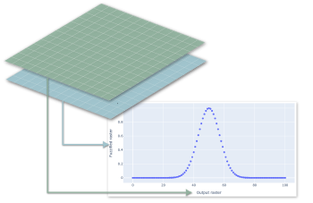

## Description

Extracts raster values of two input raster layers for an user-defined number of random point locations and plots them in an scatterplot. The random points are created within the intersection of the two raster layers.

